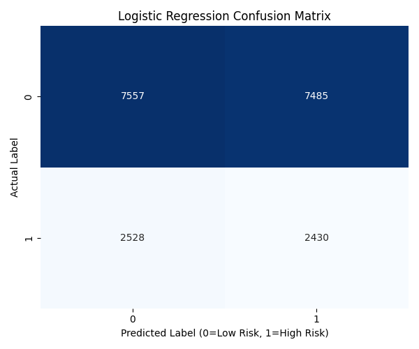
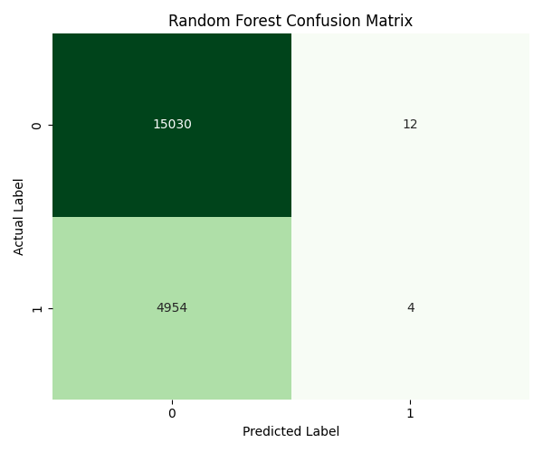
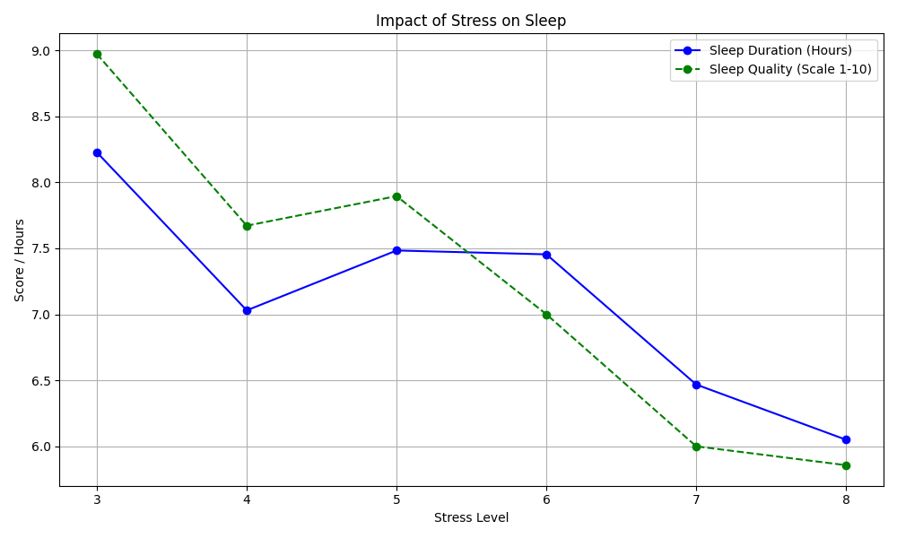
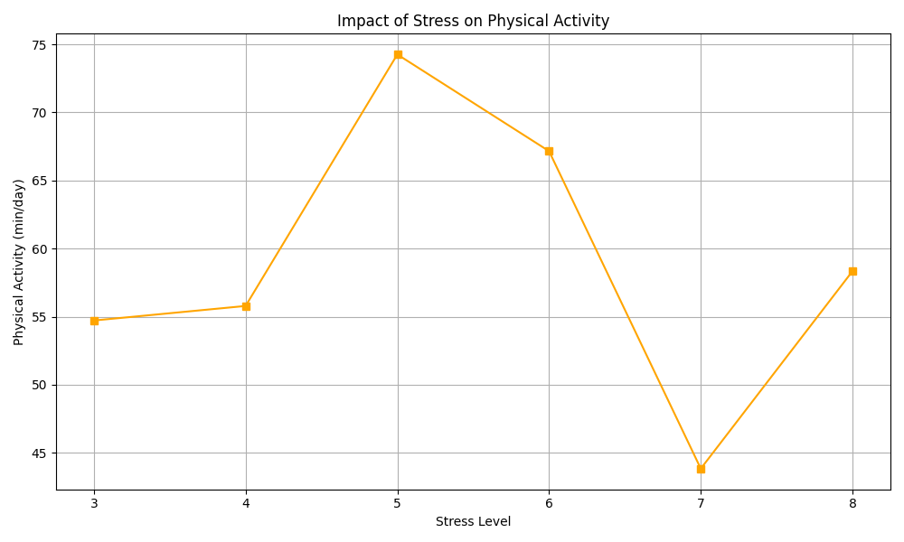
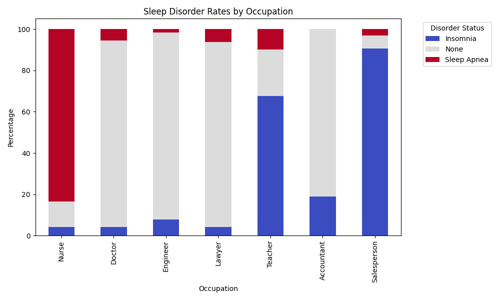

# Analysis of Lifestyle Factors and Sleep Health as Predictors of Chronic Disease Risk

## Project Overview

This project investigates the relationship between daily lifestyle habits (steps, sleep, BMI), occupational stress, and the risk of chronic disease. Using two public health datasets, the study applies machine learning techniques to classify disease risk and identifies specific occupational hazards related to sleep disorders.

A key finding of this research is the **"Accuracy Paradox,"** where a Random Forest model achieved high accuracy (75%) but failed to identify at-risk patients, whereas a Logistic Regression model provided better sensitivity despite lower overall accuracy.

## Key Findings

### 1. The Accuracy Paradox in Disease Prediction

Two models were trained to predict "High Risk" vs "Low Risk" patients.

Random Forest: Achieved 75.1% Accuracy but had a Recall of 0.00 for the high-risk class. It simply predicted "Healthy" for everyone to maximize its score.

Logistic Regression: Achieved 49.9% Accuracy but a Recall of 0.49. By using balanced class weights, it successfully identified nearly half of the at-risk population.





### 2. Stress vs. Lifestyle

Stress & Sleep: There is a strong negative correlation. As stress increases from level 3 to 8, sleep duration drops from 8.2 to 6.0 hours.

Stress & Activity: No linear correlation was found, suggesting physical activity does not automatically mitigate the perceived stress of high-demand jobs.




### 3. Occupational Sleep Risks

Nurses: Exhibit an alarmingly high rate of Sleep Apnea (83.6%).

Salespersons: Show the highest prevalence of Insomnia (90.6%).

Doctors & Engineers: Report the healthiest sleep patterns (approx. 90% disorder-free).



## Methodology & Tools

The analysis was conducted using Python with the following libraries:

Pandas: Data manipulation and cleaning.

Scikit-Learn: Model training (Logistic Regression, Random Forest), scaling, and evaluation.

Matplotlib / Seaborn: Visualization of confusion matrices and trends.

## Usage

To run the analysis locally:

1. Clone the repo.

2. Install dependencies:

```sh
pip install pandas numpy matplotlib seaborn scikit-learn
```

3. Open the notebook in the code/ folder:

```sh
jupyter notebook code/sleep_health_chronic_disease_analysis.ipynb
```

## References

R. Liaqat, "Health & Lifestyle Dataset," Kaggle.com, 2025.
[Dataset Link](https://www.kaggle.com/datasets/rehan497/health-lifestyledataset)

S. Ovi, "Sleep Health and Lifestyle Dataset," Kaggle.com, 2025.
[Dataset Link](https://www.kaggle.com/datasets/mdsultanulislamovi/sleep-disorder-diagnosis-dataset)
